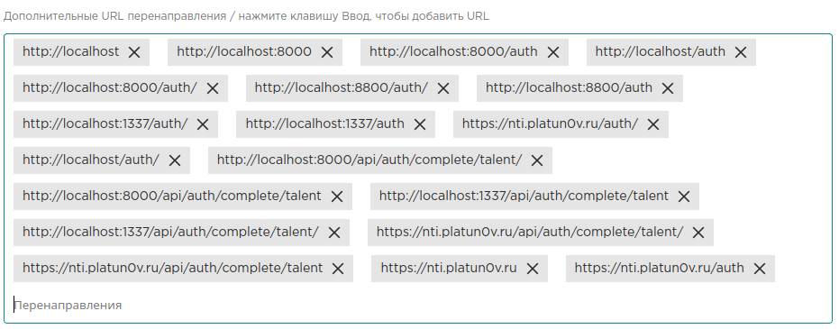

# nti-games

## Разворачивание с помощью Docker:
```bash
git clone https://github.com/Platun0v/nti_games
```
Добавте в файл `.env.example` свои значения и сохраните, как `.env`

```bash
docker-compose build
docker-compose up -d
```

После этого Docker слушает 1337 порт

## .env

- TALENT_CLIENT_ID
- STEAM_API_KEY

### Talent

1. Идем на [Talent Dev](https://talent.kruzhok.org/developer/)
2. Начинаем регистрировать приложение.
3. Задаем такие параметры:
    - URL перенаправления по умолчанию: `https://host/api/auth/complete/talent/`
    - Дополнительные URL перенаправления: `https://host/api/auth/complete/talent/`. Бывали проблемы с этими параметрами, тк он требует полного совпадения с редиректом, поэтому собралась такая коллекция юрлов 
    - Разрешенные Origins (CORS): `https://host`
    - Скоупы: `openid, user`
    - Типы ответов: `code`
    - Метод аутентификации пользователя: `client_secret_post`
4. Забираем полученные клиент id(TALENT_CLIENT_ID) и secret(TALENT_CLIENT_SECRET).

### Steam

Информация по api steam [Steam API](https://steamcommunity.com/dev).
1. Соглашаемся с правилами использования [Steam API Terms of Use](https://steamcommunity.com/dev/apiterms)
2. Получаем ключ(STEAM_API_KEY) [Register Steam API Key](https://steamcommunity.com/dev/apikey)


### Blizzard

Заходим на [Blizzard develop](https://develop.battle.net/), проходим регистрацию и тп. Далее создаем новый клиент и забираем id(BLIZZARD_CLIENT_ID) и secret(BLIZZARD_CLIENT_SECRET) для приложения.
